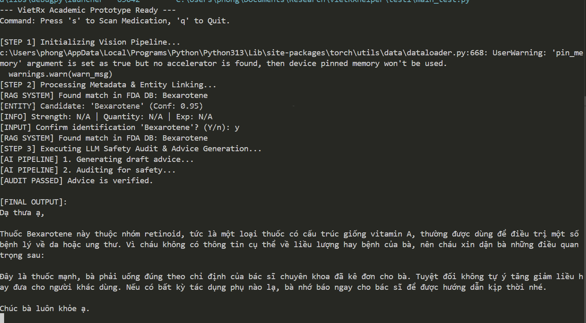
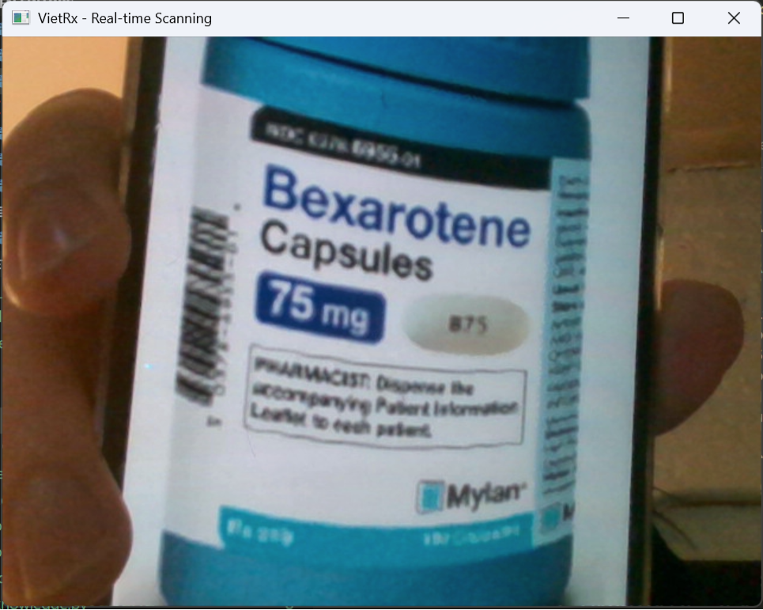

  

# VietRx Helper: Multimodal Assistive Technology for Pharmaceutical Label Interpretation

> **Abstract:** This project presents a safety-oriented, multimodal AI system designed to mitigate health literacy barriers for Vietnamese immigrants. The system integrates real-time Computer Vision (YOLOv8, EasyOCR), Retrieval-Augmented Generation (RAG) using FDA-validated datasets, and a Dual-LLM Audit Architecture to ensure pharmaceutical accuracy and cultural relevance.

---

## 1. Research Objectives and Overview

VietRx Helper is an assistive technology developed to provide elderly users with accurate, culturally adapted interpretations of medication labels. Unlike conventional translation tools, this system prioritizes clinical safety by anchoring Large Language Model (LLM) responses to verified medical databases. The primary goal is to provide a reliable interface that converts complex pharmacological data into simplified, audible Vietnamese guidance.

## 2. Technical Methodology: The Dual-Agent Safety Architecture

To prevent AI hallucinations in medical contexts, the system employs a "Reviewer-Refiner" paradigm:

1. **Generation (The Doctor Agent):** Utilizes Google Gemini to synthesize raw OCR data and FDA metadata into an empathetic response using Vietnamese honorifics.
2. **Validation (The Auditor Agent):** A secondary logic gate that performs a strict fact-check of the generated advice against source FDA records.
3. **Conflict Resolution:** If the Auditor detects discrepancies (e.g., fabricated dosages), the system triggers a recovery protocol to issue a safe, generalized warning instead of potentially harmful misinformation.

## 3. Implementation Details: Computer Vision and Entity Extraction

The system utilizes a custom-trained YOLOv8 model for label localization and EasyOCR for text recognition. To bridge raw OCR output with structured data, the system implements:
* **Fuzzy String Matching:** Employs Levenshtein distance to map noisy OCR candidates to verified FDA entries.
* **Heuristic Metadata Extraction:** A Regex-based engine designed to identify Dosage Strength (mg/ml), Quantity (Tablets/Capsules), and Expiry Dates.

## 4. System Demonstration Activity

### 4.1 Visual Identification Performance
The following figures demonstrate the system's ability to localize medication labels and extract critical metadata in a real-world environment via a live video stream.

*Figure 1a: Real-time identification interface showing successful detection of Bexarotene.*

*Figure 1b: View of the camera capture process during operation.*

### 4.2 Audible Guidance Output
The output of the Dual-LLM pipeline is converted into natural speech. You can listen to the audited sample here:
[🔊 Listen to Sample Medical Advice (advice.mp3)](advice.mp3)

### 4.3 Linguistic Adaptation and Translation
To help non-Vietnamese speakers understand the AI output, below is a translation of a typical consultation generated by the system for the drug **Bexarotene**:

| Vietnamese Output (AI Voice) | English Translation (Academic Context) |
| :--- | :--- |
| "Dạ thưa ạ, thuốc Bexarotene này là một loại thuốc đặc biệt, thuộc nhóm retinoid..." | "Hello, this Bexarotene is a specialized medication within the retinoid class..." |
| "Bà nhớ uống thuốc đúng liều lượng và cách dùng theo hướng dẫn của bác sĩ nhé." | "Please remember to take the dosage exactly as instructed by your prescribing physician." |
| "Nếu bà cảm thấy có gì lạ trong người, xin bà đừng ngần ngại gọi điện cho cháu ngay ạ." | "If you experience any unusual symptoms, please do not hesitate to contact me (the assistant) immediately." |
| "Sức khỏe của bà là quan trọng nhất ạ." | "Your health is the utmost priority." |

---

## 5. Operational Workflow and Installation

### 5.1 System Requirements
* **Environment:** Python 3.10+
* **Dependencies:** ultralytics, easyocr, opencv-python, google-genai, gTTS, pygame, python-dotenv.

### 5.2 Execution Protocol
To evaluate the real-time prototype, execute: `python main_test.py`
* Press **'s'** to initiate frame capture and analysis.
* Verify the detected drug name via the terminal prompt.
* Press **'q'** to terminate the session.

## 6. Project Structure

VietRXhelper_/
├── best.pt               # YOLOv8 custom weights
├── brain.py              # LLM Integration & Safety Auditor
├── fda_database.json     # Local FDA Knowledge Base
├── knowledge.py          # FDA Database lookup logic
├── knowledge_test.py     # Advanced entity extraction (Webcam version)
├── main.py               # Static image processing entry point
├── main_test.py          # Real-time Webcam Controller (Main Entry)
├── mining.py             # ETL script for FDA data
├── vision.py             # OCR module for files
├── vision_test.py        # Video frame processing module
├── requirements.txt      # Dependency manifest
├── advice.mp3            # Sample audio output
├── camera.png            # Demonstration image (camera view)
├── demo_capture.png      # Demonstration image (interface view)
└── README.md             # Project documentation

## 7. Author and Institutional Affiliation

Xuan Thanh Phong Nguyen
Computer Engineering Student
Department of Computer Science and Engineering
Wright State University, Dayton, Ohio

---
*Disclaimer: This system is a research prototype for academic purposes and does not constitute professional medical advice.*
